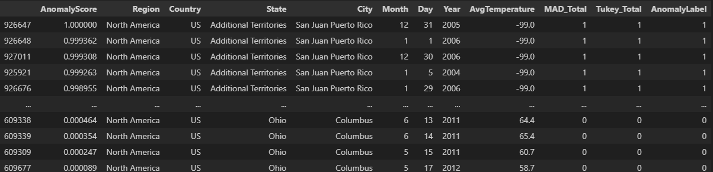

# AutoPrepAD - Automated Preprocessing Anomaly Detection Pipeline
<a href="https://html-preview.github.io/?url=https://github.com/JAdelhelm/Automated-Anomaly-Detection-Preprocessing-Pipeline/blob/main/visualization/PipelineDQ.html" target="_blank">Structure of Preprocessing Pipeline</a>

## Description
Anomaly detection is becoming increasingly important today, being utilized in various fields such as cybersecurity, data quality, healthcare, and many more. However, data preprocessing in this field is a crucial yet often time-consuming step. *Imagine gaining insights from unlabeled data while applying anomaly detection methods seamlessly.*

✅ AutPrepAD is designed to help with exactly that. It performs **preprocessing** and **cleaning** of data in Python in an **automated manner**, allowing you to **save time** and gain insights from your data.

It is widely acknowledged that anomalies are among the most important data sources due to their significant informational potential. By using this pipeline, you can save time and gain insights from data, especially when there is a lack of labels!


## Basic Usage

AutoPrepAD creates a pipeline structure that can be used for automated preprocessing in conjuction with an unsupervised anomaly detection method. It has a built-in logic of how to **automatically** clean and process your data.  
You can let your dataset run through the default AutoPrepAD pipeline by using:


````python
from pipelines.control import AutoPrepAD
from pyod.models.pca import PCA

df_data = pd.read_csv("./temperature_USA.csv")
clf_pca = PCA()

pipeline = AutoPrepAD()

pipeline.fit(
    X_train=df_data,
    clf=clf_pca,
)
X_output = pipeline.predict(X_test=df_data)

## Only automated preprocessing of the Dataframe
# X_preprocess = pipeline.preprocess(df=df_data)
````

The resulting output dataframe can be accessed by using:

````python
X_output

> Output:
    AnomalyScore  col_1  col_2   ...   col_n
1   data   ...    data   data    ...   data
2   data   ...    data   data    ...   data
... ...    ...    ...   ...      ...   ...
````

## Example


## Highlights ⭐


### 📌 Implementation of univariate methods / *Detection of univariate anomalies*
   Both methods (MOD Z-Value and Tukey Method) are resilient against outliers, ensuring that the position measurement will not be biased. They also support multivariate anomaly detection algorithms in identifying univariate anomalies.
   * MAD_Total
   * Tukey_Total

### 📌 BinaryEncoder instead of OneHotEncoder for nominal columns / *Big Data and Performance*
   Newest research shows similar results for encoding nominal columns with significantly fewer dimensions.
   - (John T. Hancock and Taghi M. Khoshgoftaar. "Survey on categorical data for neural networks." In: Journal of Big Data 7.1 (2020), pp. 1–41.)
       - Tables 2, 4
   - (Diogo Seca and João Mendes-Moreira. "Benchmark of Encoders of Nominal Features for Regression." In: World Conference on Information Systems and Technologies. 2021, pp. 146–155.)
       - P. 151

### 📌 Transformation of time series data and standardization of data with RobustScaler / *Normalization for better prediction results*

### 📌 Labeling of NaN values in an extra column instead of removing them / *No loss of information*

---
---


## Abstract View (Code Structure)


## Pipeline - Built-in Logic


---

---

## Feel free to contribute 🙂

### Reference
- https://www.researchgate.net/publication/379640146_Detektion_von_Anomalien_in_der_Datenqualitatskontrolle_mittels_unuberwachter_Ansatze (German Thesis)

### Further Information

This pipeline is designed for unsupervised applications where labels are not available. It can be utilized in various fields, for example:

- **Cybersecurity**: Detect potential cyber attacks.
- **Data Quality**: Identify broken or inconsistent data.
- **Marketing**: Discover customers with high revenue and margins.
- **Finance**: Spot unusual transactions that may indicate fraud.
- **Energy**: Identify anomalies in energy consumption patterns that could indicate inefficiencies or issues with the power grid.

- Pipeline can also be used to add extra columns (feature engineering)
    - Adds AnomalyLabel to rows
    - Marks univariate outliers
- I used sklearn's Pipeline and Transformer concept to create this preprocessing pipeline
    - Pipeline: https://scikit-learn.org/stable/modules/generated/sklearn.pipeline.Pipeline.html
    - Transformer: https://scikit-learn.org/stable/modules/generated/sklearn.base.TransformerMixin.html


