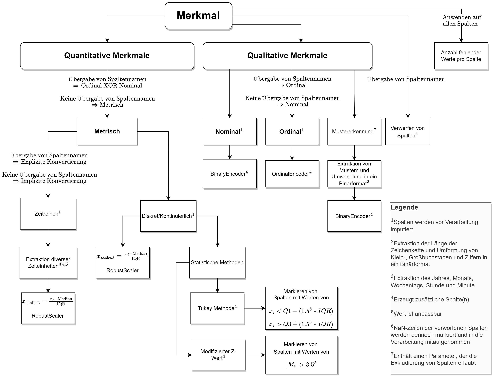

# Automated Anomaly Detection Preprocessing Pipeline
---

### I used sklearn's Pipeline and Transformer concept to create this preprocessing pipeline
- Pipeline: https://scikit-learn.org/stable/modules/generated/sklearn.pipeline.Pipeline.html
- Transformer: https://scikit-learn.org/stable/modules/generated/sklearn.base.TransformerMixin.html


## Abstract View - Project


---

## Decision rules of the pipeline



---
### How to use the pipeline

```python
import numpy as np
import pandas as pd
from dataqualitypipeline import DQPipeline
from dataqualitypipeline import initialize_autoencoder, initialize_autoencoder_modified
from pyod.models.iforest import IForest
from pyod.models.lof import LOF

df_data = pd.read_csv("./HOWTO/players_20.csv")
clf_lof = LOF(n_jobs=-1)


dq_pipe = DQPipeline(
    nominal_columns=["player_tags","preferred_foot",
                     "work_rate","team_position","loaned_from"],

    exclude_columns=["player_url","body_type","short_name", "long_name", 
                     "team_jersey_number","joined","contract_valid_until",
                     "real_face","nation_position","player_positions","nationality","club"],

    time_column_names=["dob"],
    deactivate_pattern_recognition=True,
    remove_columns_with_no_variance=True,
)


X_output = dq_pipe.run_pipeline(
    X_train=df_data.iloc[:,0:37],
    clf=clf_lof,
    dump_model=False,
)

X_output.head(40)
```

- Checkout the ``how_to.ipynb`` Notebook to use this pipeline.
    - There is an  example with only train data (unsupervised)

## Feel free to contribute 🙂

### Reference
- https://www.researchgate.net/publication/379640146_Detektion_von_Anomalien_in_der_Datenqualitatskontrolle_mittels_unuberwachter_Ansatze (German Thesis)
